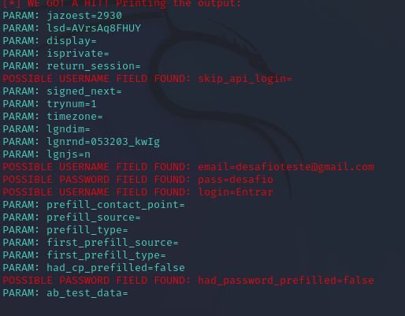

# Desafio Phishing para captura de senhas no Kali Linux

### Ferramentas

- Kali Linux
- setoolkit

### Configuração do Phishing

- Acesso root: ``` sudo su ``` 
- Iniciando setoolkit: ``` setoolkit ``` 
- Tipo de ataque: ``` 1. Social-Engineering Attack ```
- Vetor de ataque: ```2. Web Site Attack Vectors```
- Método de ataque: ```3. Credential Harvester Attack Method```
- Método de ataque: ```2. Site Cloner```
- Obtendo endereço ip: ```enter```
- Site para clone: ```http://www.facebook.com```

### Resultado



### Observações

O teste de captura foi realizado em uma segunda máquina virtual utilizando Windows XP 